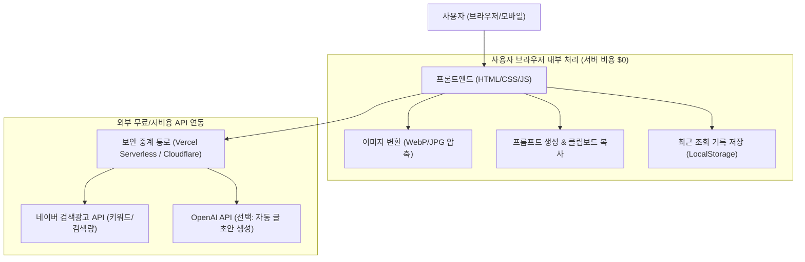

# [프로젝트 설계서] 블로그 반자동화 지원 웹 플랫폼 (Blog Automation Hub)

이 문서는 코딩 초보자도 쉽게 이해하고 단계별로 구현할 수 있도록 작성된 **블로그 반자동화 웹 서비스 전체 설계 문서(PROJECT.md)** 입니다.  
참고 사이트(`boutique-info.com`)의 핵심 기능을 분해하고, 가장 직관적이며 비용 부담 없이 운영할 수 있는 아키텍처로 설계되었습니다.

---

## 1. 프로젝트 개요 (Overview)

- **프로젝트 목적**: 블로그 글 작성에 소요되는 시간(키워드 발굴, 글 작성 기획, 썸네일 변환 등)을 대폭 단축시켜 주는 올인원 반자동화 도구 플랫폼 구축
- **대상 사용자**: 블로그(티스토리, 네이버, 워드프레스, 블로그스팟) 운영자 및 디지털 노마드
- **기술 스택 선정 기준**:
  - 복잡한 서버 유지보수 비용 최소화 (정적 웹 및 무료 서버리스 기반)
  - 코딩 초보자도 코드를 열어보고 쉽게 수정할 수 있는 직관적인 구조
  - 모바일과 PC 모두에서 보기 좋은 현대적인 다크 테마 디자인

---

## 2. 핵심 기능 정의 (Feature Specifications)

| 번호 | 기능명 | 역할 및 초보자 눈높이 설명 | 기술/연동 방식 |
| :--- | :--- | :--- | :--- |
| **F-01** | **대시보드 (홈)** | 실시간 트렌드 키워드 확인 및 주요 도구 바로가기 | 브라우저 화면 (HTML/CSS/JS) |
| **F-02** | **키워드 분석기** | 특정 키워드의 월간 검색량(PC/모바일), 경쟁도 조회 | 네이버 검색광고 무료 API 연동 |
| **F-03** | **AI 글쓰기 프롬프트 허브** | AI(ChatGPT/Claude)에게 복사해 넣으면 글을 써주는 질문 템플릿 제공 및 1클릭 복사 | 사전 제작된 템플릿 + 키워드 자동 치환 |
| **F-04** | **외부 유입 생성기** | 지식인, 카페, SNS 등 외부에서 블로그로 유입시키는 홍보 문구 자동 생성 | 맞춤형 텍스트 생성 로직 |
| **F-05** | **웹 이미지 변환기** | 스마트폰 사진(HEIC/PNG)을 가벼운 웹 이미지(WebP/JPG)로 일괄 변환 및 용량 압축 | 오픈소스 JS 라이브러리 (서버 전송 없이 브라우저 내 100% 처리) |
| **F-06** | **가이드 및 공지사항** | 초보 블로거를 위한 가이드 포스팅 및 애드센스 승인용 필수 정적 페이지 | HTML/CSS 정적 페이지 |

---

## 3. 시스템 아키텍처 및 동작 구조 (Architecture)

초보자 친화적인 구조로, 복잡하고 비싼 데이터베이스 서버 없이도 가볍게 동작하는 구조를 채택합니다.



> **왜 '보안 중계 통로(Proxy)'가 필요한가요?**  
> 네이버 API 키나 OpenAI 비밀번호를 웹페이지 화면(프론트엔드)에 그대로 넣으면 다른 사람이 내 비밀번호를 훔쳐 쓸 수 있습니다.  
> 따라서 무료로 쓸 수 있는 가벼운 통로(Vercel 함수 등)를 중간에 두어 안전하게 데이터를 주고받습니다.

---

## 4. 폴더 및 파일 구조 (Directory Structure)

누구나 코드를 열어서 직관적으로 파악할 수 있는 깔끔한 구조입니다.

```text
my-data/
├── PROJECT.md            # 본 설계 문서
├── index.html            # 메인 웹페이지 뼈대 (상단 탭으로 모든 화면 전환)
├── css/
│   ├── style.css         # 전반적인 다크모드 디자인 & 반응형 레이아웃
│   └── components.css    # 카드, 버튼, 테이블 등 부품 디자인
├── js/
│   ├── app.js            # 페이지 라우팅(화면 탭 전환) 및 전역 제어
│   ├── keyword.js        # 키워드 검색 및 결과 표 렌더링
│   ├── prompt.js         # 글쓰기 프롬프트 템플릿 및 1클릭 복사
│   └── converter.js      # 이미지(HEIC/PNG -> WebP) 변환 처리
└── api/                  # (선택) 네이버 API와 안전하게 통신하는 서버리스 함수
    └── search-keywords.js
```

---

## 5. 단계별 구현 로드맵 (Roadmap)

### 🔹 Phase 1: 기본 UI 및 독립형 도구 구현 (서버 연동 없이 바로 작동)
1. **네비게이션 및 다크 테마 UI 구축**
   - 상단 헤더, 로고, 메뉴 탭(홈, 키워드, 프롬프트, 외부유입, 이미지변환, 가이드)
   - 모던한 다크모드 + 세련된 에메랄드/인디고 포인트 컬러
2. **AI 글쓰기 프롬프트 허브 완성**
   - 카테고리별(정보성, 사용후기, 이슈, 상품리뷰) 프롬프트 탑재
   - 키워드 입력 시 본문에 자동 삽입 & 원클릭 복사 버튼
3. **이미지 변환기 (WebP 변환 & 용량 압축)**
   - 브라우저 드래그앤드롭 파일 업로드
   - 블로그 최적화 WebP 규격 자동 변환 및 일괄 다운로드

### 🔹 Phase 2: 데이터 연동 (키워드 분석 기능)
1. **키워드 검색 기능 구현**
   - 네이버 검색광고 API 연동 (월간 검색량, 클릭률, 경쟁률 지수화)
   - 결과 엑셀(Excel) 다운로드 기능 지원
2. **트렌드 키워드 섹션**
   - 실시간 인기 검색어 목록 제공

### 🔹 Phase 3: 외부 유입 도구 및 무료 배포
1. **외부 유입글 템플릿 생성기**
   - 지식인 답변 양식, 카페 질문 유도글, SNS 요약글 자동 생성기
2. **무료 웹 호스팅 배포 (Vercel / GitHub Pages)**
   - 도메인 연결 및 구글 애드센스 승인 요건(이용약관, 개인정보처리방침, 공지사항) 완성
